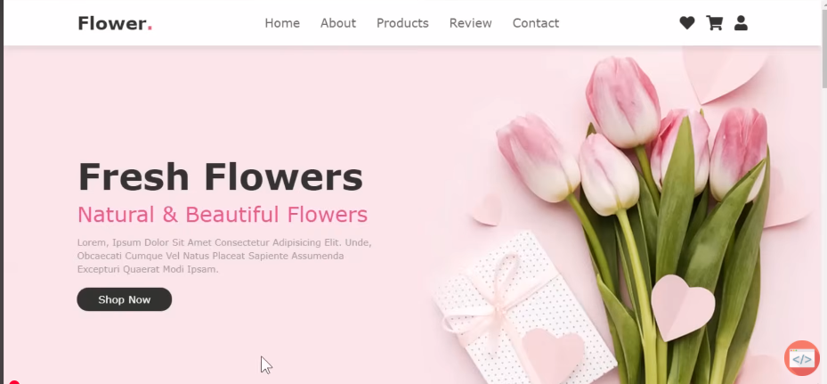
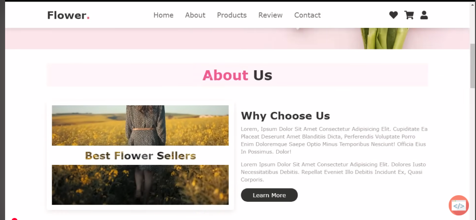
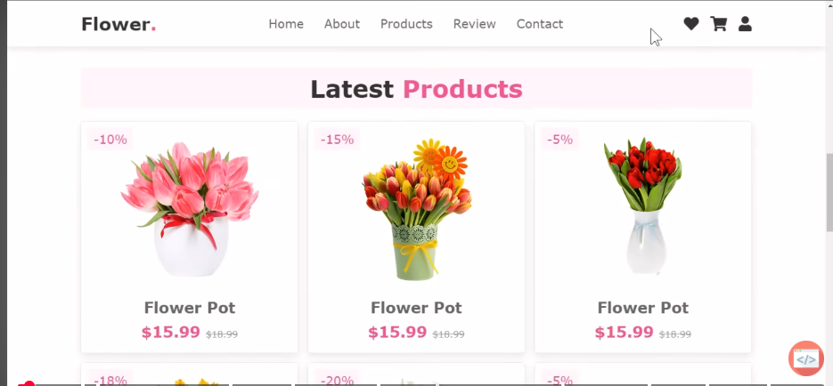
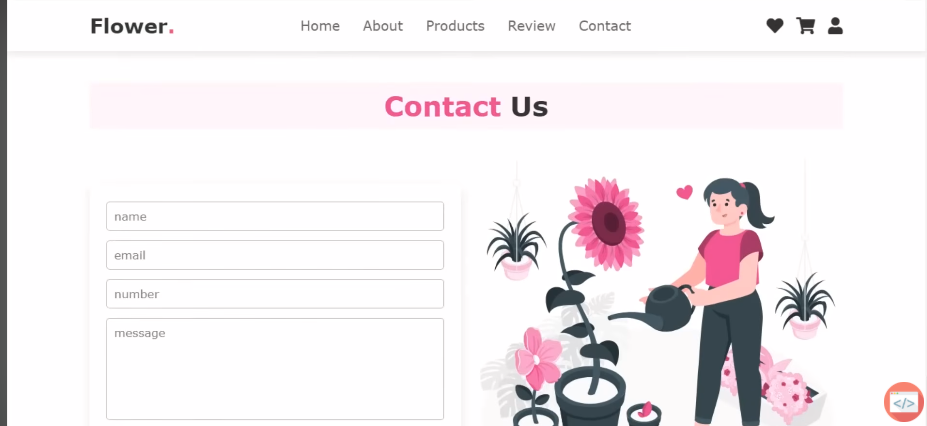
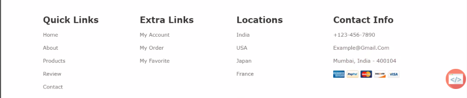

# Flower Shop

This website is an online flower shop where customers can see and buy fresh flowers. The homepage shows beautiful flowers with a short introduction and a button to start shopping. The top menu has sections like Home, About, Products, Review, and Contact, and on the right side, there are icons for wishlist, cart, and account. The main purpose of this site is to make it easy for users to explore flowers, read details, and order them online in a simple and enjoyable way.

### Link icon

#### Google icon

```
  <link rel="stylesheet" href="https://fonts.googleapis.com/css2?family=Material+Symbols+Outlined:opsz,wght,FILL,GRAD@20..48,100..700,0..1,-50..200" />
  ```


#### Font family

```
font-family:sans-serif
```

### Team Members

1 Srin Chandy

2 Rors Roeurn


### Deploye

#### Vercel

[vercel](https://vercel.com/)

### Screenshots

#### Home page



#### About page




#### Product page




#### Review page


#### Contact page



#### Footer

